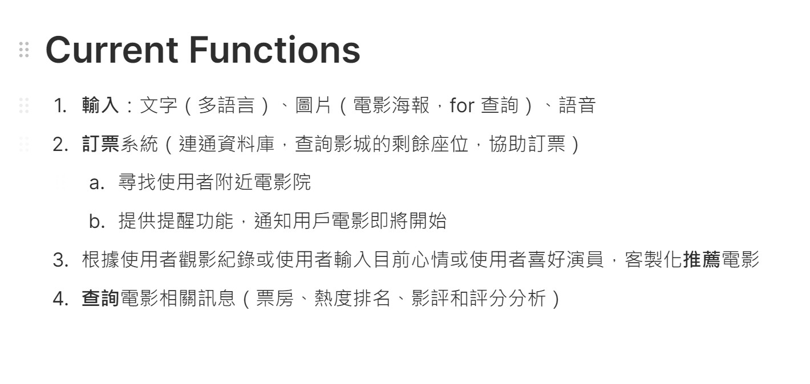

# Line bot 
## 1. Azure Translator（翻譯服務）
 * 用途：若您的電影訂票服務需要支援多語言用戶，翻譯服務可以讓 Bot 即時翻譯消息，以支援不同語言的用戶，例如繁體中文、日文和英文。
 * 應用場景：用戶可以用自己的語言輸入查詢，Bot 將其翻譯後處理，並回應對應語言的結果。
## 2. Azure Text Analytics（文字分析）
 * 用途：文字分析可以在用戶發送消息時，偵測情緒或理解關鍵詞（如電影名稱、時間、日期等），以便更準確地回應用戶需求。
 * 應用場景：例如，用戶輸入「我想看今晚的熱門電影」，Bot 可識別「今晚」和「熱門電影」等關鍵字，並進行適當的推薦或查詢。
## 3. Azure Speech Services（語音服務）
 * 用途：這項服務可以讓 Bot 支援語音消息，將語音轉換成文字進行分析，並將 Bot 的回應合成語音消息回傳給用戶。
 * 應用場景：用戶可以以語音方式進行訂票，Bot 將語音轉成文字進行處理，並回傳語音合成的票務資訊。
## 4. Azure Form Recognizer（表單識別）
 * 用途：若需處理票務確認單或表單，可透過 Form Recognizer 自動擷取資料並建立數據記錄。
 * 應用場景：用於解析電影票確認單、發票等文件，以便自動提取關鍵資訊，例如票號、放映時間和座位資訊。
## 5. Azure Bot Service（Bot 框架）
 * 用途：Azure Bot Service 是構建智能 Bot 的基礎設施，可以處理和管理 Bot 的會話邏輯。
 * 應用場景：用於管理 Line Bot 的消息流程，讓 Bot 能夠識別不同的意圖並回答相關問題，如推薦電影、訂票查詢等。
## 6. Azure Cognitive Search（搜尋服務）
 * 用途：若電影訂票系統需要支援大量電影資料和放映資訊，Azure Cognitive Search 可以實現快速、精準的查詢。
 * 應用場景：透過自然語言查詢（如「查找明天上映的科幻電影」）自動推薦適合的電影放映場次。
## 7. 整合其他服務：Google Generative AI
 * 用途：生成 AI 可用來回答和解決用戶的常見問題（如放映時間、票價或座位資訊）。
 * 應用場景：可以設置 FAQ 系統，處理用戶對電影、放映時間、購票政策等的問題。
## 8. 資料庫和支付系統的整合
 * 用途：為了完成訂票流程，您可能需要將 Line Bot 與後端資料庫（如 Azure SQL Database）連接，以儲存和管理訂單資訊。支付部分則可選擇整合常見的第三方支付服務（如 Line Pay 或 PayPal）。
 * 應用場景：用於處理座位選擇、票價計算、訂單生成和付款確認。

